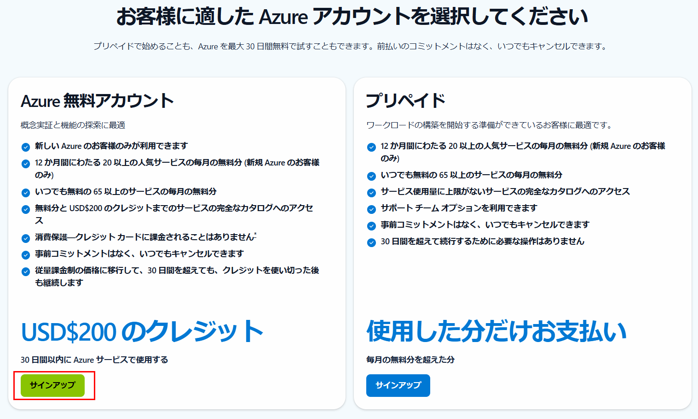
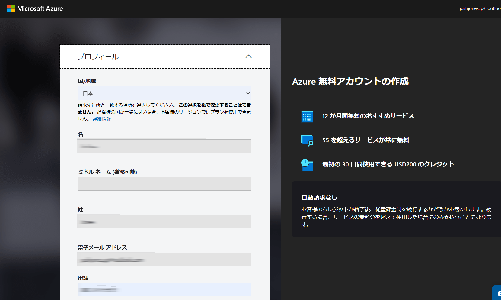
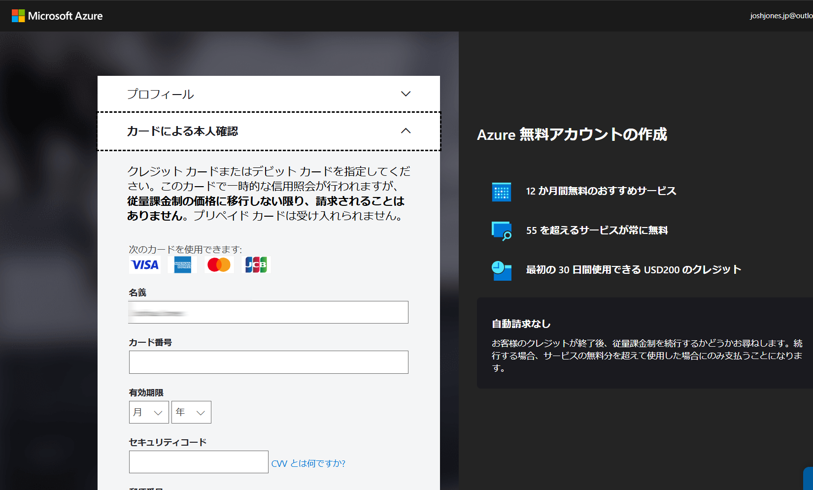
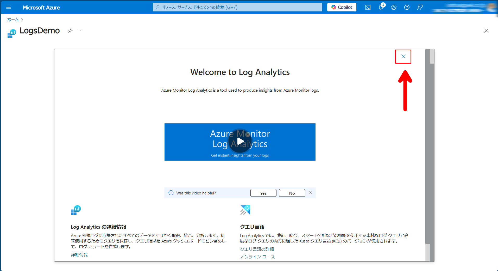
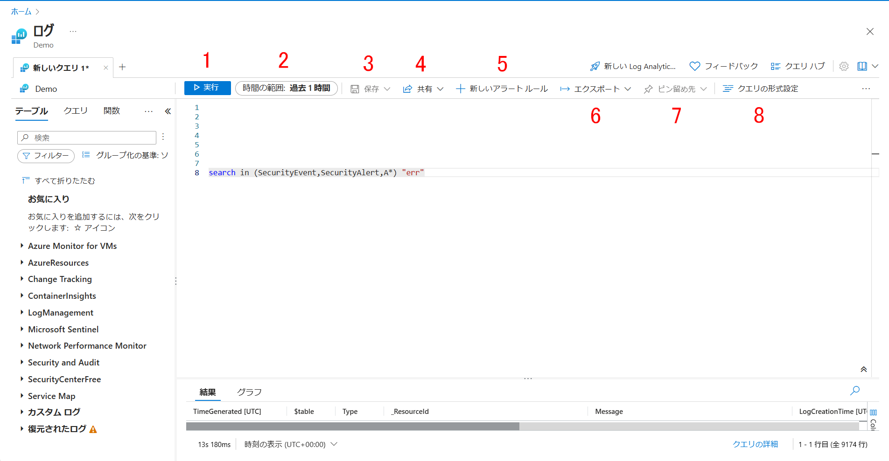
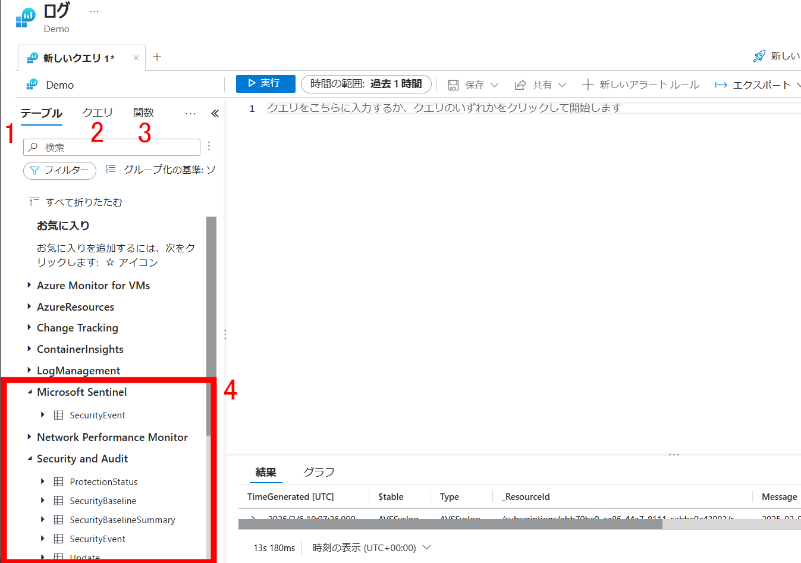
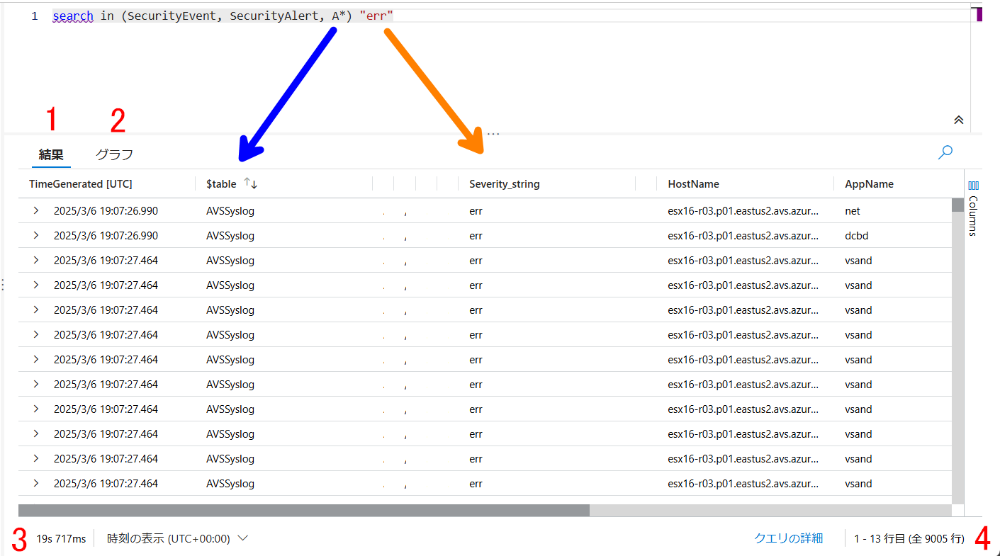

# 🔎KQLとLog Analyticsについて☁️

## KQL
Kusto クエリ言語 (KQL) は、データの探索やパターンの検出、異常や外れ値の特定、統計モデリングの作成などを行う強力なツールです。 KQL は、構造化データ、半構造化データ、非構造化データに対してクエリを実行するための、シンプルでありながら強力な言語です。 この言語は表現力があり、読みやすく、クエリの意図を理解しやすく、作成エクスペリエンス用に最適化されています。 Kusto クエリ言語は、テキスト検索と解析、時系列演算子と関数、分析と集計、地理空間、ベクトル類似性検索、およびデータ分析に最適な言語を提供するその他の多くの言語コンストラクトを深くサポートするテレメトリ、メトリック、ログのクエリに最適です。 このクエリでは、SQL に似た階層 (データベース、テーブル、列) に編成されたスキーマ エンティティが使用されます。　

## Log Analyticsワークスペース
Log Analytics ワークスペースは、すべての Azure および Azure 以外のリソースとアプリケーションから任意の種類のログ データを収集できるデータ ストアです。 ワークスペース構成オプションを使用すると、次の方法で、すべてのログ データを 1 つのワークスペースで管理し、組織内のさまざまな担当者の操作、分析、監査のニーズを満たすことができます。

<table>
  <tr>
    <th>⭐注目⭐</th>
  </tr>
  <tr>
    <td>Microsoft Sentinel では、"Microsoft Sentinel ワークスペース" という用語が使用されています。 このワークスペースは、Log Analytics ワークスペースと同じですが、Microsoft Sentinel で使用できるようになっています。 ワークスペース内のすべてのデータには、Microsoft Sentinel の価格が適用されます。</td>
  </tr>
</table>  

# ☁️Azureのアカウント作成☁️
❗既にアカウントをお持ちの方は次のセクションに進んでください。

まずは以下のリンクにアクセスしてください

<a href="https://azure.microsoft.com/ja-jp/pricing/purchase-options/azure-account" target="_blank">https://azure.microsoft.com/ja-jp/pricing/purchase-options/azure-account</a>

左側にある無料アカウントのオプションを選択

プロファイル情報を入力する

クレジットカードの情報を入力する
アカウント登録してから、1回アカウントに１００円ぐらいの料金が発生します。これはカードが有効か確認するためにあって、すぐ同じ金額が自動的に返されます。

<table>
  <tr>
    <th>ℹ️自動請求なし</th>
  </tr>
  <tr>
    <td>「お客様のクレジットが終了後、従量課金制を続行するかどうかお尋ねします。続行する場合、サービスの無料分を超えて使用した場合にのみ支払うことになります。」</td>
  </tr>
</table> 

# 🔎Log Analyticsデモにアクセス🛡️

以下のリンクをブラウザの別タブでアクセスしてください。

<!-- This link format lets us open in a seperate tab 😇 -->
<a href="https://aka.ms/lademo" target="_blank">https://aka.ms/lademo</a>

右上の青色バッテン ✖ を押してください。

## ツールの案内と説明

使い方1️⃣：アクション バー

1. **実行**: クエリウィンドウに入っているクエリが実行されます。代わりに、Shift + Enter でも実行可能
    
1. **時間の範囲**: クエリで使用できるデータの時間範囲。クエリに時間のフィルターが含まれている場合は、時間の範囲がオーバーライドされる
    
1. **保存**:　クエリをクエリ パックに保存する。今回の演習では無効となっている

1. **共有**: 次のアイテムをコピーする
   - クエリへのリンク
   - クエリのテキスト
   - クエリの結果
    
1. **新しいアラートルール**: 警告ルールの[作成]ページ を開く。 このページを使用して、アラートの種類がログ検索アラートの警告ルールを作成する。 [条件] タブが選択された状態でページが開き、[検索クエリ] フィールドにクエリが追加される

    ※デモでは無効  
    
1. **エクスポート**: クエリの結果を CSV ファイルにエクスポートする。クエリを Power BI で使用するための Power Query Formula Language 形式にエクスポートする事も可能

1. **ピン留め先**: 次のアクションが可能
   - Azureダッシュボードにピン留めする
   - Azureブックに追加する

1. **クエリの形式設定**: 選択したテキストを読みやすく配置する

使い方2️⃣：左側サイド バー

1. **テーブル**: ワークスペースに含まれるテーブル
       
1. **クエリ**: プリビルトのクエリ。選択して、右のクエリウィンドウに追加する
    
1. **関数**:　コマンドのように、他のLog Analyticsのログ クエリに対して使えるクエリ。

1. **テーブル一覧**: カテゴリーを開いて、ワークスペースに含まれているテーブルの確認ができる。Securityを開いてみましょう。

使い方3️⃣：結果ウィンドウ

1. **結果**: クエリしたデータがテーブル（列ｘ行）形式で表示される
    
1. **グラフ**: クエリしたデータを視覚化で表示
    
1. **クエリ時間**: クエリを実施するためかかった時間

1. **結果の範囲**: 表情されている行と全て行のカウント

1. **青色矢印**: search in でテーブルをフィルターする。A*利用すると、Ａで始まるテーブル名が選択される。これで、AVSSyslogがクエリされた

1. **オレンジ色矢印**: errというテキストが含まれる行が検索される

# 演習：Microsoft Sentinel用の KQL

### 以下のクエリ練習によって、ハンズオンでKQLの勉強ができる。Log Analyticsのデモ ワークスペースによって、演習のクエリはたまにエラーが発生する。パラメーターの調整や Copilot 等の生成AIツールでトラブルシューティングを行ってください。

## **1️⃣**
以下のクエリをコピーして、クエリウィンドウに使用してください

<link rel="stylesheet" href="//cdnjs.cloudflare.com/ajax/libs/highlight.js/10.7.2/styles/default.min.css">

<pre><code class="kusto">
search "err"
</code></pre>

<table>
  <tr>
    <th>💡ヒント</th>
  </tr>
  <tr>
    <td>最初の search クエリでは、エラーを回避する場合は、クエリ ウィンドウで時間範囲を "過去 1 時間" に調整することが必要になる場合があります。</td>
  </tr>
</table>  

上左のプラス ➕ ボタンを押して、別Log Analyticsタブで以下のクエリを試してください

<link rel="stylesheet" href="//cdnjs.cloudflare.com/ajax/libs/highlight.js/10.7.2/styles/default.min.css">

<pre><code class="kusto">
search in (SecurityEvent,SecurityAlert,A*) "err"
</code></pre>

<table>
  <tr>
    <th>✅理解確認</th>
  </tr>
  <tr>
    <td>２つのタブにあるクエリ結果を比べよう。クエリ時間はどっちが早いですか？</td>
  </tr>
</table> 

## **2️⃣**

テーブルをフィルターしましょう。「where」を使うと、テーブルのサブセットだけを取得する。

whereを利用する以下のクエリを試してください

<link rel="stylesheet" href="//cdnjs.cloudflare.com/ajax/libs/highlight.js/10.7.2/styles/default.min.css">

<pre><code class="kusto">
SecurityEvent
| where TimeGenerated > ago(1d)
</code></pre>

<link rel="stylesheet" href="//cdnjs.cloudflare.com/ajax/libs/highlight.js/10.7.2/styles/default.min.css">

<pre><code class="kusto">
SecurityEvent
| where TimeGenerated > ago(1h) and EventID == "4624"
</code></pre>

<link rel="stylesheet" href="//cdnjs.cloudflare.com/ajax/libs/highlight.js/10.7.2/styles/default.min.css">

<pre><code class="kusto">
SecurityEvent
| where TimeGenerated > ago(1h)
| where EventID == 4624
| where AccountType =~ "user"
</code></pre>

<link rel="stylesheet" href="//cdnjs.cloudflare.com/ajax/libs/highlight.js/10.7.2/styles/default.min.css">

<pre><code class="kusto">
SecurityEvent | where EventID in (4624, 4625)
</code></pre>

<table>
  <tr>
    <th>✅理解確認</th>
  </tr>
  <tr>
    <td>上記のクエリには、SecurityEventは何の役割ですか？</td>
  </tr>
</table> 

## **3️⃣**

以下のクエリでは、letは変数を作るために使用される

<link rel="stylesheet" href="//cdnjs.cloudflare.com/ajax/libs/highlight.js/10.7.2/styles/default.min.css">

<pre><code class="kusto">
let timeOffset = 7d;
let discardEventId = 4688;
SecurityEvent
| where TimeGenerated > ago(timeOffset*2) and TimeGenerated < ago(timeOffset)
| where EventID != discardEventId
</code></pre>

let ステートメントを使用すると、動的なテーブルまたはリストを作成ができる。

<link rel="stylesheet" href="//cdnjs.cloudflare.com/ajax/libs/highlight.js/10.7.2/styles/default.min.css">

<pre><code class="kusto">
let suspiciousAccounts = datatable(account: string) [
    @"\administrator", 
    @"NT AUTHORITY\SYSTEM"
];
SecurityEvent | where Account in (suspiciousAccounts)
</code></pre>

<link rel="stylesheet" href="//cdnjs.cloudflare.com/ajax/libs/highlight.js/10.7.2/styles/default.min.css">

<pre><code class="kusto">
let LowActivityAccounts =
    SecurityEvent 
    | summarize cnt = count() by Account 
    | where cnt < 1000;
LowActivityAccounts | where Account contains "SQL"
</code></pre>

## **4️⃣**

Extend演算子（オペレーター）は新しい計算さらた列を作成する。以下のクエリで試そう：

<link rel="stylesheet" href="//cdnjs.cloudflare.com/ajax/libs/highlight.js/10.7.2/styles/default.min.css">

<pre><code class="kusto">
SecurityEvent
| where ProcessName != "" and Process != ""
| extend StartDir =  substring(ProcessName,0, string_size(ProcessName)-string_size(Process))
</code></pre>

## **5️⃣**

order byを利用すると、列を使用して行の順番を並べ替える。

<link rel="stylesheet" href="//cdnjs.cloudflare.com/ajax/libs/highlight.js/10.7.2/styles/default.min.css">

<pre><code class="kusto">
SecurityEvent
| where ProcessName != "" and Process != ""
| extend StartDir =  substring(ProcessName,0, string_size(ProcessName)-string_size(Process))
| order by StartDir desc, Process asc
</code></pre>

## **6️⃣**

プロジェクトを使用すると、結果に含まれる列の構成ができる。

| 演算子 | 説明 |
|----------|----------|
| project | 含める列、名前を変更する列、または削除する列を選択し、新しい計算列を挿入します。 |
| project-away | 出力から除去する入力の列を選択します。 |
| project-keep | 出力に保持する入力の列を選択します。|
| project-rename | 結果の出力で名前を変更する列を選択します。 |
| project-reorder | 結果の出力における列の順序を設定します。 |

<link rel="stylesheet" href="//cdnjs.cloudflare.com/ajax/libs/highlight.js/10.7.2/styles/default.min.css">

<pre><code class="kusto">
SecurityEvent
| project Computer, Account
</code></pre>

<link rel="stylesheet" href="//cdnjs.cloudflare.com/ajax/libs/highlight.js/10.7.2/styles/default.min.css">

<pre><code class="kusto">
SecurityEvent
| where ProcessName != "" and Process != ""
| extend StartDir =  substring(ProcessName,0, string_size(ProcessName)-string_size(Process))
| order by StartDir desc, Process asc
| project Process, StartDir
</code></pre>

<link rel="stylesheet" href="//cdnjs.cloudflare.com/ajax/libs/highlight.js/10.7.2/styles/default.min.css">

<pre><code class="kusto">
SecurityEvent
| where ProcessName != "" and Process != ""
| extend StartDir =  substring(ProcessName,0, string_size(ProcessName)-string_size(Process))
| order by StartDir desc, Process asc
| project-away ProcessName)
</code></pre>

# 🧩演習：クエリ作成チャレンジ🧩

このチャレンジでは、クエリがまだ完了していない。
コメントを読んで、タスクを実施するためにクエリを編集してください。
上記以外の演算子を使用してもいいので、以下のリソースリンクにアクセスしてください。

<a href="https://learn.microsoft.com/ja-jp/kusto/query/tutorials/learn-common-operators?view=azure-data-explorer" target="_blank">https://learn.microsoft.com/ja-jp/kusto/query/tutorials/learn-common-operators?view=azure-data-explorer</a>

## **1️⃣**

<link rel="stylesheet" href="//cdnjs.cloudflare.com/ajax/libs/highlight.js/10.7.2/styles/default.min.css">

<pre><code class="kusto">
// SecurityEvent テーブルでのログイン失敗を見つける
SecurityEvent
| where _______________ == "Account logon failure"
| project TimeGenerated, Account, _______________
</code></pre>

## **2️⃣**

<link rel="stylesheet" href="//cdnjs.cloudflare.com/ajax/libs/highlight.js/10.7.2/styles/default.min.css">

<pre><code class="kusto">
// SecurityEvent テーブルでのソース別のイベント数をカウントする
SecurityEvent
| summarize _______________ by _______________
</code></pre>

## **3️⃣**

<link rel="stylesheet" href="//cdnjs.cloudflare.com/ajax/libs/highlight.js/10.7.2/styles/default.min.css">

<pre><code class="kusto">
// SecurityEvent テーブルで過去1週間以内の特定の時間範囲で発生したイベントをフィルタリングする
SecurityEvent
| where TimeGenerated > ago(7d)
| where _______________ between (time(08:00:00) and time(18:00:00))
</code></pre>

## **4️⃣**

<link rel="stylesheet" href="//cdnjs.cloudflare.com/ajax/libs/highlight.js/10.7.2/styles/default.min.css">

<pre><code class="kusto">
// SecurityEvent テーブルで特定のユーザーが短期間に複数回の失敗したログイン試行を行った場合の不正アクセス試行を特定する
SecurityEvent
| where EventID == _______________
| summarize _______________ by bin(TimeGenerated, 1h), _______________
| where _______________ > 5
| project _______________, _______________, _______________
</code></pre>

## **5️⃣**

<link rel="stylesheet" href="//cdnjs.cloudflare.com/ajax/libs/highlight.js/10.7.2/styles/default.min.css">

<pre><code class="kusto">
// SecurityEvent テーブルで異常なネットワークアクティビティを検出し、特定のIPアドレスからの異常なイベントを見つける
SecurityEvent
| where _______________ == 3
| summarize _______________ by _______________
| join kind=inner (SecurityEvent | where _______________ | summarize count() by IPAddress) on _______________
| where _______________ > 10
| project _______________, _______________, _______________
</code></pre>

## 回答例

全て完了してから、回答例を確認してください

<a href="KQLチャレンジ回答例.html" target="_blank">KQLチャレンジ回答例</a>
